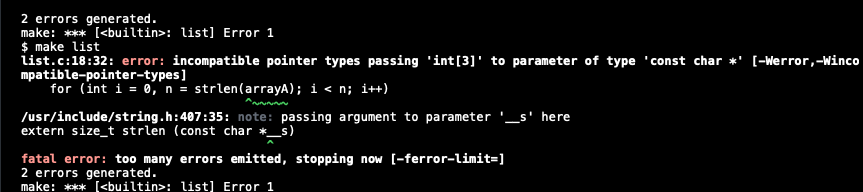

### `Issue`

- 배열의 크기가 3인 상황에서 배열의 크기를 늘리려고 한다면?
    
    이 아이디어를 코드로 작성했을 때 처음 만난 문제
    
    ```c
    int main (void)
    {
        // 1. 배열 A: 길이가 3인 int형 배열 생성.(값은 1, 2, 3)
        int arrayA = [1, 2, 3];
    
        // 2. 배열 B: 길이가 4인 int형 배열을 생성할 메모리 공간 할당.
        int *arrayB = malloc(4 * sizeof(int));
    
        // 3. 배열 A의 값들을 배열 B에 복사.
        for (int i = 0, n = strlen(arrayA); i < n; i++)
        {
            arrayB[i] = arrayA[i];
        }
        // 4. 배열 B의 4번째 location에 value 4 insert.
        arrayB[3] = 4;
    
        printf("%i", arrayB);
    }
    ```




1. 배열을 생성하는 syntax가 잘못된 것 같음.
2. int 배열인데 strlen으로 해버림 ..
3. arrayB를 출력할 때 위 코드에서 처럼 형식지정자를 %i로 작성했으나 arrayB를 변수로 넘겨준다는 건 해당 배열의 첫 번째 바이트의 주소를 가리키는 포인터를 선언한거라 에러가 남.


해결 완료 코드

```c
#include <stdio.h>
#include <cs50.h>
#include <string.h>
#include <stdlib.h>

int main (void)
{
    // 1. 배열 A: 길이가 3인 int형 배열 생성.(값은 1, 2, 3)
    int arrayA[3];
    *arrayA = 1;
    *(arrayA + 1) = 2;
    *(arrayA + 2) = 3;

    // 2. 배열 B: 길이가 4인 int형 배열을 생성할 메모리 공간 할당.
    int *arrayB = malloc(4 * sizeof(int));

    // 3. 배열 A의 값들을 배열 B에 복사.
    for (int i = 0; i < 3; i++)
    {
        arrayB[i] = arrayA[i];
    }
    // 4. 배열 B의 4번째 location에 value 4 insert.
    arrayB[3] = 4;

    for (int i = 0; i < 4; i++)
    {
         printf("배열 B의 %i번째 값: %i\n", i, *(arrayB + i));
    }
}
```
내가 몰랐던 점
1. C언어에서 배열을 생성한다는 것은 그 연속된 메모리의 첫 메모리의 주소를 가리키는 포인터를 생성하는 것이다.
2. 따라서 해당 주소에 접근(참조 연산자(*))해서 값을 할당해야 함.